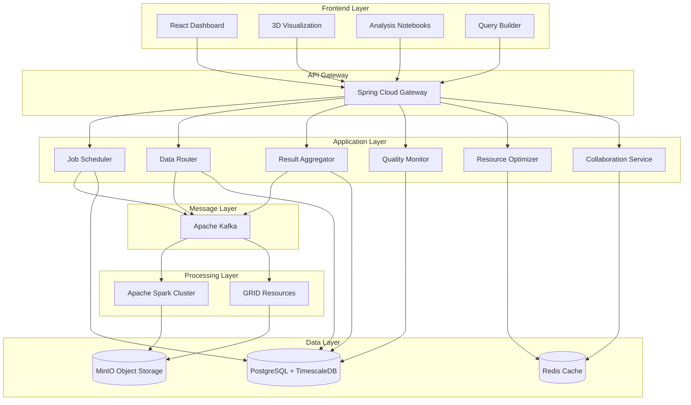

# ALYX Distributed Analysis Orchestrator - Design Document

## Overview

ALYX is a distributed analysis orchestrator designed to handle petabyte-scale high-energy physics data processing with real-time visualization and collaborative analysis capabilities. The system architecture follows a microservices pattern with event-driven processing, leveraging modern web technologies for the frontend and enterprise Java services for the backend.

The system is designed to process 50,000+ collision events per second while supporting 400+ concurrent users with sub-second response times. It implements a three-tier architecture: presentation layer (React frontend), application layer (Java microservices), and data layer (PostgreSQL with extensions).

## Architecture

### High-Level Architecture



### Microservices Architecture

The backend consists of six core microservices:

1. **Job Scheduler Service**: Manages analysis job lifecycle and resource allocation
2. **Data Router Service**: Handles intelligent data distribution and locality optimization
3. **Result Aggregator Service**: Combines partial results from distributed processing
4. **Quality Monitor Service**: Validates data integrity and processing quality
5. **Resource Optimizer Service**: ML-based resource allocation and performance optimization
6. **Collaboration Service**: Real-time synchronization for multi-user sessions

## Components and Interfaces

### Frontend Components

#### Real-time Analysis Dashboard
- **Technology**: React 18+ with TypeScript, Material-UI components
- **WebSocket Integration**: Socket.io for real-time updates
- **State Management**: Redux Toolkit for complex state coordination
- **Performance**: Virtual scrolling for large datasets, memoization for expensive calculations

#### 3D Visualization Engine
- **Technology**: Three.js with WebGL for hardware acceleration
- **Data Processing**: Web Workers for particle trajectory calculations
- **Interaction**: Orbit controls, selection highlighting, animation timeline
- **Optimization**: Level-of-detail rendering, frustum culling, instanced geometry

#### Query Builder Interface
- **Technology**: React DnD for drag-and-drop functionality
- **SQL Generation**: Abstract syntax tree construction with validation
- **Preview**: Real-time query preview with syntax highlighting
- **Caching**: Query result caching with intelligent invalidation

#### Analysis Notebooks
- **Technology**: Monaco Editor with custom physics analysis kernel
- **Execution**: Remote kernel execution on GRID resources
- **Collaboration**: Operational transformation for concurrent editing
- **Visualization**: Integrated plotting with D3.js and custom physics visualizations

### Backend Services

#### Job Scheduler Service
```java
@RestController
@RequestMapping("/api/jobs")
public class JobSchedulerController {
    
    @PostMapping("/submit")
    public ResponseEntity<JobSubmissionResponse> submitJob(
        @RequestBody JobSubmissionRequest request) {
        // Validate job parameters
        // Estimate resource requirements using ML model
        // Queue job with priority assignment
        // Return job ID and estimated completion time
    }
    
    @GetMapping("/{jobId}/status")
    public ResponseEntity<JobStatus> getJobStatus(@PathVariable String jobId) {
        // Return current job status, progress, and resource allocation
    }
}
```

#### Data Router Service
- **Intelligent Partitioning**: Routes data based on temporal and spatial locality
- **Load Balancing**: Distributes processing load across available GRID resources
- **Fault Tolerance**: Automatic failover and data replication
- **Performance Monitoring**: Real-time metrics collection and alerting

#### Resource Optimizer Service
- **ML Model**: TensorFlow-based prediction of job execution times
- **Scheduling Algorithm**: Priority queue with preemption capabilities
- **Resource Monitoring**: Real-time GRID resource availability tracking
- **Cost Optimization**: Dynamic resource allocation based on budget constraints

## Data Models

### Core Domain Models

#### Collision Event
```java
@Entity
@Table(name = "collision_events", 
       indexes = {
           @Index(name = "idx_timestamp", columnList = "timestamp"),
           @Index(name = "idx_energy_range", columnList = "center_of_mass_energy"),
           @Index(name = "idx_spatial", columnList = "detector_geometry")
       })
public class CollisionEvent {
    @Id
    private UUID eventId;
    
    @Column(nullable = false)
    private Instant timestamp;
    
    @Column(nullable = false)
    private Double centerOfMassEnergy;
    
    @Type(type = "jsonb")
    private List<DetectorHit> detectorHits;
    
    @Type(type = "geometry")
    private Point collisionVertex;
    
    @OneToMany(mappedBy = "event", cascade = CascadeType.ALL)
    private List<ParticleTrack> reconstructedTracks;
}
```

#### Analysis Job
```java
@Entity
@Table(name = "analysis_jobs")
public class AnalysisJob {
    @Id
    private UUID jobId;
    
    @Column(nullable = false)
    private String userId;
    
    @Enumerated(EnumType.STRING)
    private JobStatus status;
    
    @Type(type = "jsonb")
    private JobParameters parameters;
    
    @Column
    private Instant submittedAt;
    
    @Column
    private Instant estimatedCompletion;
    
    @Column
    private Integer allocatedCores;
    
    @Column
    private Long memoryAllocationMB;
}
```

#### Database Schema Design

**Time-Series Partitioning Strategy**:
```sql
-- Partition collision_events by month for optimal query performance
CREATE TABLE collision_events_y2024m01 PARTITION OF collision_events
    FOR VALUES FROM ('2024-01-01') TO ('2024-02-01');

-- Spatial indexing for detector geometry queries
CREATE INDEX CONCURRENTLY idx_collision_events_spatial 
    ON collision_events USING GIST (detector_geometry);

-- Materialized view for common aggregate queries
CREATE MATERIALIZED VIEW daily_collision_summary AS
SELECT 
    DATE_TRUNC('day', timestamp) as day,
    COUNT(*) as event_count,
    AVG(center_of_mass_energy) as avg_energy,
    COUNT(DISTINCT user_id) as unique_users
FROM collision_events 
GROUP BY DATE_TRUNC('day', timestamp);
```

## Correctness Properties

*A property is a characteristic or behavior that should hold true across all valid executions of a system-essentially, a formal statement about what the system should do. Properties serve as the bridge between human-readable specifications and machine-verifiable correctness guarantees.*

### Property Reflection

After analyzing all acceptance criteria, I've identified several areas where properties can be consolidated to eliminate redundancy:

- **Job Management Properties**: Properties 1-5 can be streamlined to focus on core job lifecycle behaviors
- **Visualization Properties**: Properties 6-10 can be combined into comprehensive rendering and interaction properties  
- **Query Properties**: Properties 11-15 can be consolidated into query generation, execution, and validation properties
- **Performance Properties**: Properties 16-20 can be unified around throughput and resource management
- **Collaboration Properties**: Properties 21-25 can be combined into synchronization and conflict resolution properties
- **Data Management Properties**: Properties 26-30 can be consolidated into storage, caching, and integrity properties
- **Resource Optimization Properties**: Properties 31-35 can be unified around scheduling and allocation behaviors
- **Notebook Properties**: Properties 36-39 can be combined into notebook lifecycle and execution properties

### Core Correctness Properties

**Property 1: Job submission and validation**
*For any* analysis job with valid parameters, submitting it through the web interface should result in successful queuing with a unique identifier and estimated completion time
**Validates: Requirements 1.1, 1.2**

**Property 2: Invalid job rejection**
*For any* analysis job with invalid parameters, the system should reject the submission and provide specific error messages without queuing the job
**Validates: Requirements 1.3**

**Property 3: Job status consistency**
*For any* queued analysis job, status queries should return current progress and resource allocation information that accurately reflects the job's actual state
**Validates: Requirements 1.4**

**Property 4: Permission-based job control**
*For any* physics user with appropriate permissions, job cancellation and modification operations should succeed, while users without permissions should be denied access
**Validates: Requirements 1.5**

**Property 5: Visualization rendering performance**
*For any* collision event selected for visualization, the system should render particle trajectories in 3D space within 2 seconds and include all required elements (detector geometry, particle paths, hit points)
**Validates: Requirements 2.1, 2.2**

**Property 6: Interactive visualization responsiveness**
*For any* user interaction with the 3D view (rotation, zoom, pan), the system should provide smooth controls and maintain performance regardless of the number of loaded collision events
**Validates: Requirements 2.3, 2.4**

**Property 7: Real-time visualization updates**
*For any* visualization data update, the system should automatically refresh the display via WebSocket connections without user intervention
**Validates: Requirements 2.5**

**Property 8: Query generation and execution**
*For any* valid query parameters specified in the query builder, the system should generate optimized SQL and execute it against the collision database within 2 seconds for 99% of queries
**Validates: Requirements 3.2, 3.4**

**Property 9: Large result set handling**
*For any* query returning more than 10,000 records, the system should implement pagination and provide accurate result count estimates
**Validates: Requirements 3.3**

**Property 10: Query validation feedback**
*For any* invalid query syntax, the system should provide real-time validation feedback before execution without attempting to run the query
**Validates: Requirements 3.5**

**Property 11: High-throughput event processing**
*For any* collision event stream in normal operating conditions, the system should maintain throughput of at least 50,000 events per second using parallel processing
**Validates: Requirements 4.1, 4.4**

**Property 12: Distributed load balancing**
*For any* available GRID resource configuration, the system should automatically distribute processing load across multiple nodes to optimize resource utilization
**Validates: Requirements 4.2**

**Property 13: Backpressure and overload handling**
*For any* processing bottleneck or system overload condition, the system should implement backpressure mechanisms to prevent data loss and queue excess work with estimated processing delays
**Validates: Requirements 4.3, 4.5**

**Property 14: Real-time collaboration synchronization**
*For any* analysis workspace with multiple physics users, the system should synchronize their views in real-time and propagate parameter changes to all collaborators immediately
**Validates: Requirements 5.1, 5.2**

**Property 15: Concurrent editing conflict resolution**
*For any* concurrent editing scenario, the system should resolve conflicts using operational transformation algorithms while maintaining sub-second response times
**Validates: Requirements 5.3, 5.5**

**Property 16: Collaborative session management**
*For any* physics user joining a collaborative session, the system should provide their cursor position and selections to other users in the session
**Validates: Requirements 5.4**

**Property 17: Optimized data storage and retrieval**
*For any* collision event data storage operation, the system should use time-series partitioning and serve frequently accessed data from Redis cache within 100 milliseconds
**Validates: Requirements 6.1, 6.3**

**Property 18: Spatial query optimization**
*For any* spatial query on detector geometry, the system should utilize PostGIS extensions for efficient processing
**Validates: Requirements 6.2**

**Property 19: High-concurrency connection management**
*For any* database load exceeding 1000 concurrent users, the system should maintain connection pooling without performance degradation
**Validates: Requirements 6.4**

**Property 20: Data integrity validation**
*For any* data integrity check, the system should validate checksums and immediately flag any corruption detected
**Validates: Requirements 6.5**

**Property 21: ML-based job scheduling**
*For any* submitted analysis job, the system should predict execution time using machine learning models and schedule based on data locality and resource capacity
**Validates: Requirements 7.1, 7.2**

**Property 22: Priority-based preemption**
*For any* high-priority job queued while lower-priority work is running, the system should implement preemption mechanisms to prioritize the high-priority work
**Validates: Requirements 7.3**

**Property 23: Fault-tolerant job recovery**
*For any* job failure due to resource issues, the system should automatically restart the job with checkpointing to preserve completed work
**Validates: Requirements 7.4**

**Property 24: Dynamic resource optimization**
*For any* suboptimal resource utilization condition, the system should dynamically reallocate computing resources to maximize overall throughput
**Validates: Requirements 7.5**

**Property 25: Notebook environment consistency**
*For any* code cell execution in analysis notebooks, the system should provide access to collision data APIs and visualization libraries consistently
**Validates: Requirements 8.2**

**Property 26: Notebook persistence and sharing**
*For any* notebook save operation, the system should persist both code and execution results with version control, and maintain execution environment consistency when shared with collaborators
**Validates: Requirements 8.3, 8.4**

**Property 27: Resource-intensive notebook execution**
*For any* notebook execution requiring significant resources, the system should queue the work on appropriate GRID resources automatically
**Validates: Requirements 8.5**

<function_calls>
<invoke name="prework">
<parameter name="featureName">alyx-distributed-orchestrator
##
 Error Handling

### Distributed System Resilience

**Circuit Breaker Pattern**: Implement circuit breakers for external service calls to prevent cascade failures
```java
@Component
public class GridResourceCircuitBreaker {
    private final CircuitBreaker circuitBreaker = CircuitBreaker.ofDefaults("gridResource");
    
    public CompletableFuture<ResourceAllocation> allocateResources(JobRequest request) {
        return circuitBreaker.executeSupplier(() -> 
            gridResourceService.allocateResources(request)
        );
    }
}
```

**Retry Mechanisms**: Exponential backoff with jitter for transient failures
- Network timeouts: 3 retries with 1s, 2s, 4s delays
- Database connection failures: 5 retries with exponential backoff
- GRID resource allocation failures: 10 retries with adaptive delay based on resource availability

**Data Consistency**: 
- Event sourcing for critical state changes
- Saga pattern for distributed transactions
- Eventual consistency with conflict resolution for collaborative features

### Error Categories and Handling

1. **User Input Errors**: Immediate validation with detailed error messages
2. **System Resource Errors**: Graceful degradation with user notification
3. **Data Corruption Errors**: Automatic recovery from replicas with integrity verification
4. **Network Errors**: Transparent retry with fallback to cached data
5. **Processing Errors**: Job restart with checkpointing and error reporting

## Testing Strategy

### Dual Testing Approach

The ALYX system requires both unit testing and property-based testing to ensure comprehensive coverage:

- **Unit tests** verify specific examples, edge cases, and error conditions
- **Property tests** verify universal properties that should hold across all inputs
- Together they provide comprehensive coverage: unit tests catch concrete bugs, property tests verify general correctness

### Unit Testing Strategy

Unit tests will focus on:
- **Component Integration**: Testing interactions between microservices
- **Edge Cases**: Boundary conditions for data processing and visualization
- **Error Scenarios**: Specific failure modes and recovery mechanisms
- **Performance Benchmarks**: Specific performance targets under controlled conditions

**Technology Stack**: JUnit 5 + Mockito for Java services, Jest + React Testing Library for frontend components

### Property-Based Testing Strategy

**Technology**: We will use **QuickCheck for Java** (net.java.quickcheck) for property-based testing of backend services and **fast-check** for frontend property testing.

**Configuration**: Each property-based test will run a minimum of 100 iterations to ensure statistical confidence in the results.

**Property Test Implementation Requirements**:
- Each property-based test MUST be tagged with a comment explicitly referencing the correctness property from this design document
- Tag format: **Feature: alyx-distributed-orchestrator, Property {number}: {property_text}**
- Each correctness property MUST be implemented by a SINGLE property-based test
- Property tests should be placed as close to implementation as possible to catch errors early

**Example Property Test Structure**:
```java
@Test
public void testJobSubmissionValidation() {
    // **Feature: alyx-distributed-orchestrator, Property 1: Job submission and validation**
    qt().forAll(validJobParametersGenerator())
        .check((jobParams) -> {
            JobSubmissionResponse response = jobScheduler.submitJob(jobParams);
            return response.getJobId() != null && 
                   response.getEstimatedCompletion() != null &&
                   jobQueue.contains(response.getJobId());
        });
}
```

### Integration Testing

- **End-to-End Workflows**: Complete user journeys from job submission to result visualization
- **Performance Testing**: Load testing with simulated 400+ concurrent users using Gatling
- **Chaos Engineering**: Fault injection testing for distributed system resilience
- **Data Pipeline Testing**: Full data flow validation from ingestion to analysis results

### Test Data Management

- **Synthetic Physics Data**: Generated collision events with known properties for validation
- **Performance Test Data**: Scalable datasets for throughput and latency testing  
- **Edge Case Data**: Boundary conditions and malformed data for robustness testing
- **Collaborative Scenarios**: Multi-user test scenarios for real-time collaboration features