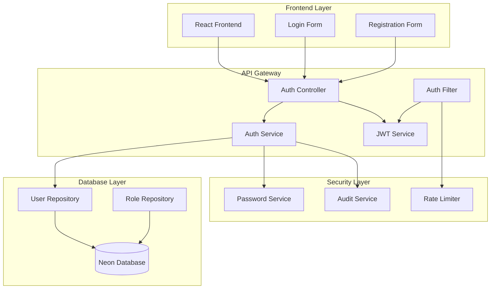
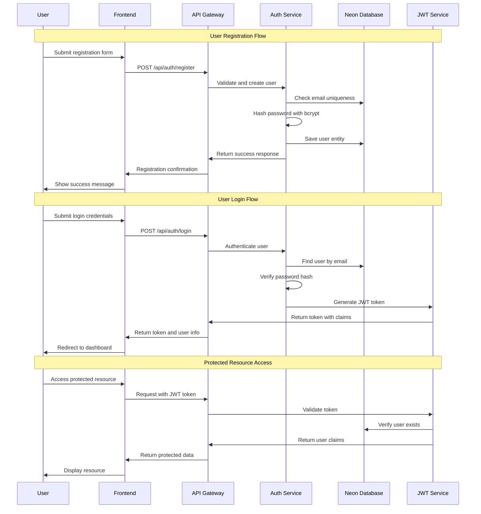

# Design Document

## Overview

This design implements a production-ready authentication system for the ALYX distributed analysis orchestrator, replacing hardcoded demo users with a secure, database-backed authentication service using Neon PostgreSQL. The system provides user registration, login, JWT-based authentication, role-based authorization, and comprehensive security features suitable for production deployment.

The authentication system integrates seamlessly with the existing Spring Boot microservices architecture while providing scalable user management through Neon's serverless PostgreSQL platform. All authentication operations are secured with industry-standard practices including bcrypt password hashing, JWT tokens, rate limiting, and comprehensive audit logging.

## Architecture

### System Components



### Authentication Flow



## Components and Interfaces

### Database Schema

```sql
-- Users table with comprehensive user information
CREATE TABLE users (
    id UUID PRIMARY KEY DEFAULT gen_random_uuid(),
    email VARCHAR(255) UNIQUE NOT NULL,
    password_hash VARCHAR(255) NOT NULL,
    first_name VARCHAR(100) NOT NULL,
    last_name VARCHAR(100) NOT NULL,
    organization VARCHAR(100),
    role_id UUID NOT NULL REFERENCES roles(id),
    is_active BOOLEAN DEFAULT true,
    email_verified BOOLEAN DEFAULT false,
    failed_login_attempts INTEGER DEFAULT 0,
    locked_until TIMESTAMP,
    created_at TIMESTAMP DEFAULT CURRENT_TIMESTAMP,
    updated_at TIMESTAMP DEFAULT CURRENT_TIMESTAMP,
    last_login_at TIMESTAMP
);

-- Roles table for role-based access control
CREATE TABLE roles (
    id UUID PRIMARY KEY DEFAULT gen_random_uuid(),
    name VARCHAR(50) UNIQUE NOT NULL,
    description TEXT,
    permissions TEXT[], -- JSON array of permissions
    hierarchy_level INTEGER NOT NULL,
    created_at TIMESTAMP DEFAULT CURRENT_TIMESTAMP
);

-- Audit log for security events
CREATE TABLE auth_audit_log (
    id UUID PRIMARY KEY DEFAULT gen_random_uuid(),
    user_id UUID REFERENCES users(id),
    event_type VARCHAR(50) NOT NULL,
    event_details JSONB,
    ip_address INET,
    user_agent TEXT,
    success BOOLEAN NOT NULL,
    created_at TIMESTAMP DEFAULT CURRENT_TIMESTAMP
);

-- Indexes for performance optimization
CREATE INDEX idx_users_email ON users(email);
CREATE INDEX idx_users_role_id ON users(role_id);
CREATE INDEX idx_users_active ON users(is_active);
CREATE INDEX idx_audit_log_user_id ON auth_audit_log(user_id);
CREATE INDEX idx_audit_log_event_type ON auth_audit_log(event_type);
CREATE INDEX idx_audit_log_created_at ON auth_audit_log(created_at);
```

### Core Entities

#### User Entity
```java
@Entity
@Table(name = "users")
public class User {
    @Id
    @GeneratedValue(strategy = GenerationType.UUID)
    private UUID id;
    
    @Column(unique = true, nullable = false)
    @Email
    private String email;
    
    @Column(name = "password_hash", nullable = false)
    private String passwordHash;
    
    @Column(name = "first_name", nullable = false)
    private String firstName;
    
    @Column(name = "last_name", nullable = false)
    private String lastName;
    
    private String organization;
    
    @ManyToOne(fetch = FetchType.EAGER)
    @JoinColumn(name = "role_id", nullable = false)
    private Role role;
    
    @Column(name = "is_active")
    private Boolean isActive = true;
    
    @Column(name = "email_verified")
    private Boolean emailVerified = false;
    
    @Column(name = "failed_login_attempts")
    private Integer failedLoginAttempts = 0;
    
    @Column(name = "locked_until")
    private LocalDateTime lockedUntil;
    
    @CreationTimestamp
    @Column(name = "created_at")
    private LocalDateTime createdAt;
    
    @UpdateTimestamp
    @Column(name = "updated_at")
    private LocalDateTime updatedAt;
    
    @Column(name = "last_login_at")
    private LocalDateTime lastLoginAt;
}
```

#### Role Entity
```java
@Entity
@Table(name = "roles")
public class Role {
    @Id
    @GeneratedValue(strategy = GenerationType.UUID)
    private UUID id;
    
    @Column(unique = true, nullable = false)
    private String name;
    
    private String description;
    
    @Type(JsonType.class)
    @Column(columnDefinition = "jsonb")
    private List<String> permissions;
    
    @Column(name = "hierarchy_level", nullable = false)
    private Integer hierarchyLevel;
    
    @CreationTimestamp
    @Column(name = "created_at")
    private LocalDateTime createdAt;
}
```

### Service Layer Architecture

#### AuthService Interface
```java
public interface AuthService {
    UserRegistrationResponse registerUser(UserRegistrationRequest request);
    UserLoginResponse authenticateUser(UserLoginRequest request);
    void logoutUser(String token);
    User findUserByEmail(String email);
    void updateLastLogin(UUID userId);
    void incrementFailedLoginAttempts(UUID userId);
    void resetFailedLoginAttempts(UUID userId);
    boolean isAccountLocked(User user);
}
```

#### PasswordService Interface
```java
public interface PasswordService {
    String hashPassword(String plainPassword);
    boolean verifyPassword(String plainPassword, String hashedPassword);
    boolean isPasswordStrong(String password);
    void validatePasswordStrength(String password);
}
```

#### JwtService Enhanced Interface
```java
public interface JwtService {
    String generateToken(User user);
    boolean validateToken(String token);
    String extractUserEmail(String token);
    UUID extractUserId(String token);
    List<String> extractPermissions(String token);
    String extractRole(String token);
    Date extractExpiration(String token);
    boolean isTokenExpired(String token);
}
```

## Data Models

### Request/Response DTOs

#### UserRegistrationRequest
```java
public class UserRegistrationRequest {
    @NotBlank(message = "Email is required")
    @Email(message = "Invalid email format")
    private String email;
    
    @NotBlank(message = "Password is required")
    @Size(min = 8, message = "Password must be at least 8 characters")
    @Pattern(regexp = "^(?=.*[a-z])(?=.*[A-Z])(?=.*\\d)(?=.*[@$!%*?&])[A-Za-z\\d@$!%*?&].*$",
             message = "Password must contain uppercase, lowercase, number, and special character")
    private String password;
    
    @NotBlank(message = "First name is required")
    @Size(max = 100, message = "First name must not exceed 100 characters")
    private String firstName;
    
    @NotBlank(message = "Last name is required")
    @Size(max = 100, message = "Last name must not exceed 100 characters")
    private String lastName;
    
    @Size(max = 100, message = "Organization must not exceed 100 characters")
    private String organization;
    
    @NotBlank(message = "Role is required")
    private String roleName;
}
```

#### UserLoginRequest
```java
public class UserLoginRequest {
    @NotBlank(message = "Email is required")
    @Email(message = "Invalid email format")
    private String email;
    
    @NotBlank(message = "Password is required")
    private String password;
    
    private boolean rememberMe = false;
}
```

#### UserLoginResponse
```java
public class UserLoginResponse {
    private String token;
    private String tokenType = "Bearer";
    private Long expiresIn;
    private UserProfileDto user;
    private LocalDateTime timestamp;
}
```

### Configuration Models

#### Neon Database Configuration
```yaml
spring:
  datasource:
    url: ${NEON_DATABASE_URL:jdbc:postgresql://localhost:5432/alyx}
    username: ${NEON_DATABASE_USERNAME:alyx_user}
    password: ${NEON_DATABASE_PASSWORD:alyx_password}
    driver-class-name: org.postgresql.Driver
    hikari:
      maximum-pool-size: 20
      minimum-idle: 5
      idle-timeout: 300000
      connection-timeout: 20000
      leak-detection-threshold: 60000
      
  jpa:
    hibernate:
      ddl-auto: validate
    properties:
      hibernate:
        dialect: org.hibernate.dialect.PostgreSQLDialect
        format_sql: false
        show_sql: false
        jdbc:
          time_zone: UTC
    show-sql: false
    
  flyway:
    enabled: true
    locations: classpath:db/migration
    baseline-on-migrate: true
    validate-on-migrate: true

# JWT Configuration
jwt:
  secret: ${JWT_SECRET:your-256-bit-secret-key-here}
  expiration: ${JWT_EXPIRATION:86400000} # 24 hours
  refresh-expiration: ${JWT_REFRESH_EXPIRATION:604800000} # 7 days

# Security Configuration
security:
  password:
    bcrypt-rounds: 12
  rate-limiting:
    login-attempts: 5
    lockout-duration: 900 # 15 minutes
  audit:
    enabled: true
    retention-days: 90
```

## Correctness Properties

*A property is a characteristic or behavior that should hold true across all valid executions of a system-essentially, a formal statement about what the system should do. Properties serve as the bridge between human-readable specifications and machine-verifiable correctness guarantees.*

Now I need to analyze the acceptance criteria to determine which ones are testable as properties:

<function_calls>
<invoke name="prework">
<parameter name="featureName">neon-auth-system

Based on the prework analysis, I'll now consolidate redundant properties and create comprehensive correctness properties:

### Property Reflection

After reviewing all testable properties from the prework analysis, I've identified several areas where properties can be consolidated:

- Properties 1.1 and 1.5 can be combined into a comprehensive registration property
- Properties 2.1 and 2.4 can be combined into a comprehensive login property  
- Properties 3.1 and 3.4 both relate to password hashing and can be combined
- Properties 5.1 and 8.3 both relate to JWT token claims and can be combined
- Properties 7.5 and 5.5 both relate to audit logging and can be combined

### Correctness Properties

**Property 1: User Registration Integrity**
*For any* valid user registration data (unique email, strong password, valid names), registering the user should create a database record with hashed password and return a success response with user ID
**Validates: Requirements 1.1, 1.5**

**Property 2: Email Uniqueness Enforcement**
*For any* email address that already exists in the database, attempting to register with that email should be rejected with an appropriate error message
**Validates: Requirements 1.2**

**Property 3: Input Validation Consistency**
*For any* invalid input data (malformed emails, weak passwords), the registration and login endpoints should reject the request with specific validation errors
**Validates: Requirements 1.3, 1.4**

**Property 4: Authentication Round Trip**
*For any* user that has been successfully registered, logging in with their correct credentials should authenticate successfully and return a valid JWT token with user information
**Validates: Requirements 2.1, 2.4**

**Property 5: Failed Authentication Handling**
*For any* incorrect login credentials (wrong password or non-existent email), the authentication should fail with consistent error messages that don't reveal user existence
**Validates: Requirements 2.2, 2.3**

**Property 6: Rate Limiting Protection**
*For any* user account, multiple consecutive failed login attempts should trigger rate limiting and account lockout mechanisms
**Validates: Requirements 2.5**

**Property 7: Password Security Consistency**
*For any* password stored in the system, it should be hashed using bcrypt with minimum 12 salt rounds and never stored in plaintext
**Validates: Requirements 3.1, 3.4**

**Property 8: Secure Password Verification**
*For any* password verification operation, the system should use constant-time comparison methods to prevent timing attacks
**Validates: Requirements 3.2**

**Property 9: JWT Token Integrity**
*For any* issued JWT token, it should contain valid expiration time, user claims, role information, and permissions data
**Validates: Requirements 5.1, 8.3**

**Property 10: Token Validation Completeness**
*For any* JWT token validation, the system should verify signature, expiration, and user existence in the database
**Validates: Requirements 5.2**

**Property 11: Token Lifecycle Management**
*For any* expired or invalidated token, the system should reject access attempts and require re-authentication
**Validates: Requirements 5.3, 5.4**

**Property 12: Comprehensive Audit Logging**
*For any* authentication event (login, logout, failed attempts, suspicious activity), the system should generate appropriate audit log entries with sufficient detail
**Validates: Requirements 5.5, 7.5**

**Property 13: Concurrent Operation Safety**
*For any* concurrent user registration or authentication operations, the system should maintain data integrity without corruption or race conditions
**Validates: Requirements 7.1**

**Property 14: Error Response Security**
*For any* error condition, the system should return appropriate HTTP status codes and safe error messages without exposing sensitive information
**Validates: Requirements 7.3**

**Property 15: Role Assignment Consistency**
*For any* user registration, the system should assign appropriate default roles based on organization and validation rules
**Validates: Requirements 8.1**

**Property 16: Permission Validation Accuracy**
*For any* role-based permission check, the system should validate permissions against database-stored role definitions consistently
**Validates: Requirements 8.2, 8.5**

**Property 17: Role Change Token Invalidation**
*For any* user role change, the system should invalidate existing tokens and require new token generation with updated permissions
**Validates: Requirements 8.4**

**Property 18: Database-Backed Authentication**
*For any* authentication operation, the system should query the Neon database for user validation rather than using hardcoded credentials
**Validates: Requirements 9.2**

**Property 19: Database Constraint Enforcement**
*For any* data integrity requirement, the system should enforce unique email constraints and proper foreign key relationships at the database level
**Validates: Requirements 10.3**

## Error Handling

### Authentication Error Categories

1. **Validation Errors (400 Bad Request)**
   - Invalid email format
   - Weak password requirements
   - Missing required fields
   - Invalid input data types

2. **Authentication Errors (401 Unauthorized)**
   - Invalid credentials
   - Expired tokens
   - Malformed tokens
   - Account locked due to failed attempts

3. **Authorization Errors (403 Forbidden)**
   - Insufficient permissions
   - Role-based access denied
   - Account disabled or suspended

4. **Resource Errors (409 Conflict)**
   - Email already exists during registration
   - Concurrent modification conflicts

5. **System Errors (500 Internal Server Error)**
   - Database connection failures
   - Encryption/decryption errors
   - Unexpected system exceptions

### Error Response Format

```json
{
  "error": {
    "code": "AUTH_INVALID_CREDENTIALS",
    "message": "Invalid email or password",
    "timestamp": "2024-01-08T10:30:00Z",
    "path": "/api/auth/login",
    "details": {
      "field": "credentials",
      "reason": "authentication_failed"
    }
  }
}
```

### Retry and Circuit Breaker Patterns

- Database operations implement exponential backoff retry (3 attempts)
- Circuit breaker pattern for external service dependencies
- Graceful degradation when non-critical services are unavailable
- Connection pool monitoring and automatic recovery

## Testing Strategy

### Dual Testing Approach

The authentication system requires both unit tests and property-based tests to ensure comprehensive coverage:

**Unit Tests** focus on:
- Specific examples of valid and invalid inputs
- Edge cases like boundary conditions and error scenarios
- Integration points between components
- Mock-based testing of service interactions

**Property-Based Tests** focus on:
- Universal properties that hold across all valid inputs
- Security properties like password hashing consistency
- Comprehensive input coverage through randomization
- Invariant validation across different execution paths

### Property-Based Testing Configuration

- **Testing Framework**: QuickCheck for Java (jqwik library)
- **Minimum Iterations**: 100 per property test
- **Test Tagging**: Each property test references its design document property
- **Tag Format**: `@Tag("Feature: neon-auth-system, Property N: property-description")`

### Test Categories

#### Unit Test Examples
```java
@Test
void shouldRejectRegistrationWithExistingEmail() {
    // Given existing user
    User existingUser = createTestUser("test@example.com");
    userRepository.save(existingUser);
    
    // When attempting to register with same email
    UserRegistrationRequest request = new UserRegistrationRequest();
    request.setEmail("test@example.com");
    
    // Then should throw conflict exception
    assertThrows(EmailAlreadyExistsException.class, 
        () -> authService.registerUser(request));
}
```

#### Property Test Examples
```java
@Property
@Tag("Feature: neon-auth-system, Property 1: User Registration Integrity")
void userRegistrationIntegrity(@ForAll("validUserData") UserRegistrationRequest request) {
    // When registering with valid data
    UserRegistrationResponse response = authService.registerUser(request);
    
    // Then user should exist in database with hashed password
    User savedUser = userRepository.findByEmail(request.getEmail()).orElseThrow();
    assertThat(savedUser.getPasswordHash()).isNotEqualTo(request.getPassword());
    assertThat(passwordService.verifyPassword(request.getPassword(), savedUser.getPasswordHash())).isTrue();
    assertThat(response.getUserId()).isEqualTo(savedUser.getId());
}

@Provide
Arbitrary<UserRegistrationRequest> validUserData() {
    return Combinators.combine(
        Arbitraries.emails(),
        strongPasswords(),
        Arbitraries.strings().alpha().ofMinLength(2).ofMaxLength(50),
        Arbitraries.strings().alpha().ofMinLength(2).ofMaxLength(50),
        Arbitraries.of("CERN", "FERMILAB", "DESY", "KEK"),
        Arbitraries.of("PHYSICIST", "ANALYST")
    ).as(UserRegistrationRequest::new);
}
```

### Integration Testing

- **TestContainers**: Use real Neon PostgreSQL containers for database integration tests
- **End-to-End Flows**: Test complete registration → login → protected resource access workflows
- **Performance Testing**: Validate sub-second response times under concurrent load
- **Security Testing**: Verify rate limiting, password hashing, and audit logging

### Test Environment Configuration

```yaml
# Test-specific configuration
spring:
  profiles:
    active: test
  datasource:
    url: jdbc:tc:postgresql:15:///testdb
    driver-class-name: org.testcontainers.jdbc.ContainerDatabaseDriver
  jpa:
    hibernate:
      ddl-auto: create-drop
    show-sql: true

# Property-based test configuration
jqwik:
  database:
    tries: 100
  reporting:
    only-failures: false
  shrinking:
    mode: BOUNDED
```

This comprehensive design provides a production-ready authentication system that replaces hardcoded demo users with secure, scalable database-backed authentication using Neon PostgreSQL, complete with extensive testing to ensure reliability across all deployment environments.